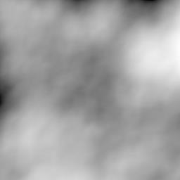

# Perlin Noise Generator

## Overview
This is a **Proof of Concept (PoC)** implementation of a Perlin noise generator written in C#. It allows users to create grayscale Perlin noise images based on customizable parameters such as dimensions, octaves, and persistence. The generated noise can be used for visual experimentation, terrain generation, or as a heatmap prototype.

> **Note:** This project is purely for fun and educational purposes. It is not intended for commercial use.

## Features
- Generate Perlin noise images with customizable dimensions.
- Control the number of octaves to adjust noise detail.
- Adjust persistence to fine-tune the amplitude scaling across octaves.
- Output noise as a grayscale JPEG image.

## Prerequisites
- .NET Framework or .NET Core compatible environment
- Basic understanding of C# to compile and run the code

## How to Use
1. Clone or download this repository.
2. Open the project in your preferred C# IDE (e.g., Visual Studio or Rider).
3. Compile and run the project.
4. Follow the prompts:
    - Enter the width and height of the output image.
    - Specify the number of octaves (recommended: 2-10).
    - Enter the persistence value (range: 0.0 - 1.0).
5. The generated Perlin noise image will be saved as `perlin_noise.jpg` in the same directory.

## Example Parameters
- **Width/Height:** 512x512
- **Octaves:** 6
- **Persistence:** 0.5

## Example Output
The generated `perlin_noise.jpg` will be a grayscale representation of the Perlin noise based on the provided parameters.

## Disclaimer
This project is a demonstration and should not be considered a robust implementation. It was made solely for experimentation and enjoyment, without any guarantee of performance or quality.
